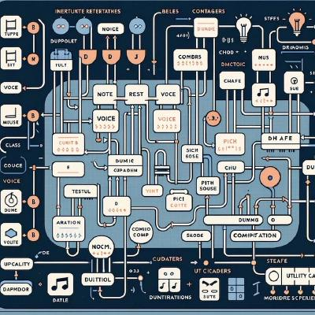

# Klarenz/TinySynth

- Klarenz is a Haskell DSL for experimentation, creative control, code generation and composition.

- TinySynth is minimalistic high-performance C++ audio engine designed to interface with JACK2

## Project Structure

- `tinysynth/`: C++ audio engine
- `klarenz/`: Haskell Domain Specific Language 

## Prerequisites

- JACK Audio Connection Kit - Linux sound multicore low-latency server API
- Dear ImGui - immediate GUI
- GHC - Haskell compiler and interpreter
- Stack - Haskell deterministic build tool
- scsynth - James McCartney's SuperCollider Server
- CMake 

## Getting Started

[Work in Progress, check in later]
